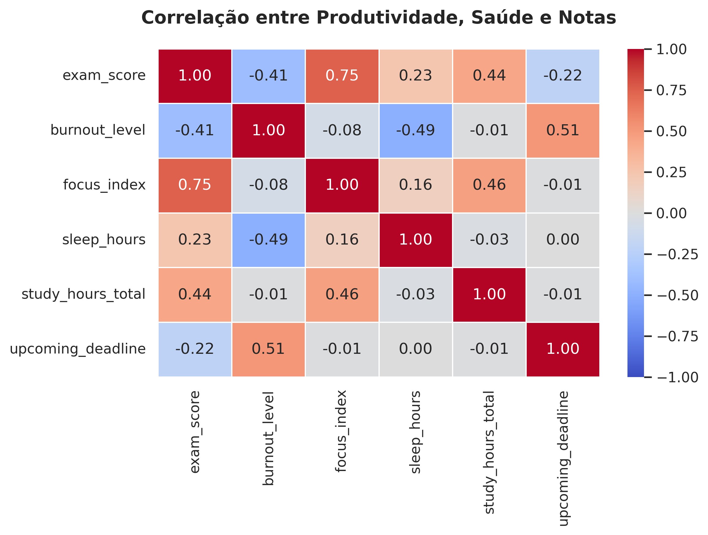
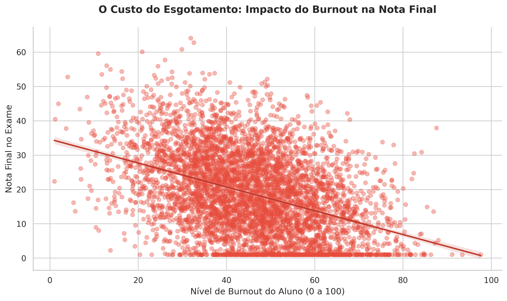
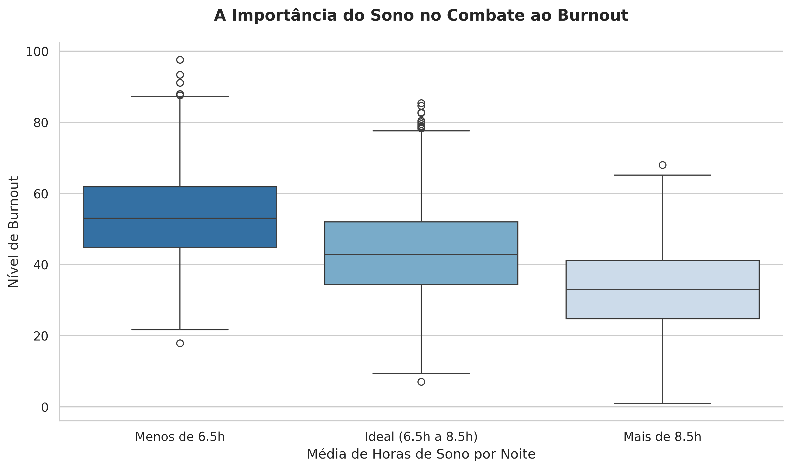

# Análise de Produtividade e Saúde Mental Estudantil 

## Objetivo do Projeto
Este projeto analisa os padrões de produtividade, hábitos de estudo e indicadores de saúde mental de 5.000 estudantes. O objetivo principal é identificar quais fatores realmente impulsionam o sucesso acadêmico (notas) e quais são os principais gatilhos para o esgotamento mental (burnout), fornecendo insights baseados em dados para otimizar o desempenho sem sacrificar o bem-estar.

##  Tecnologias e Ambiente
* **Linguagem:** Python 3
* **Bibliotecas:** Pandas, Matplotlib, Seaborn, Scikit-Learn
* **Ambiente de Desenvolvimento:** Fedora Linux (Jupyter Notebooks em ambiente virtual com miniconda)
* **Técnicas Aplicadas:** Data Wrangling, Ordinal Encoding, Feature Engineering (Engenharia de Atributos), Análise de Correlação de Pearson, Visualização de Dados (Storytelling).

##  Estrutura do Projeto
* `notebooks/01_limpeza.ipynb`: Importação, tratamento de dados, encoding de variáveis categóricas e criação de novos atributos
* `notebooks/02_eda.ipynb`: Análise exploratória focada em estatística descritiva e correlações matemáticas.
* `notebooks/03_visualizacao.ipynb`: Construção de gráficos focados em responder às perguntas de negócio.
* `data/`: Diretório contendo os datasets bruto e processado.
* `img/`: Pasta com os gráficos plotados no projeto
## Principais Insights e Descobertas

**1. Qualidade supera Quantidade (O Poder do Foco)**
A análise de correlação revelou que o "Índice de Foco" (0.74) e a "Saúde Mental" (0.54) possuem um impacto muito maior na nota final do que as horas brutas de estudo (0.43).

**2. O Custo Real do Esgotamento**
O `burnout_level` se mostrou o maior detrator de notas do dataset (-0.40). A linha de tendência comprova que, à medida que o esgotamento aumenta, a performance acadêmica despenca severamente.

**3. O Sono como Escudo Protetor**
Dormir é produtivo. A correlação negativa forte do sono (-0.49) com o burnout indica que alunos que mantêm uma higiene de sono ideal (6.5h a 8.5h) conseguem blindar sua saúde mental contra as pressões da rotina.

## 📬 Contato
Desenvolvido por [Bruno Lima]
* [LinkedIn](www.linkedin.com/in/bruno-lima3)
* e-mail: ozamodas123@gmail.com
